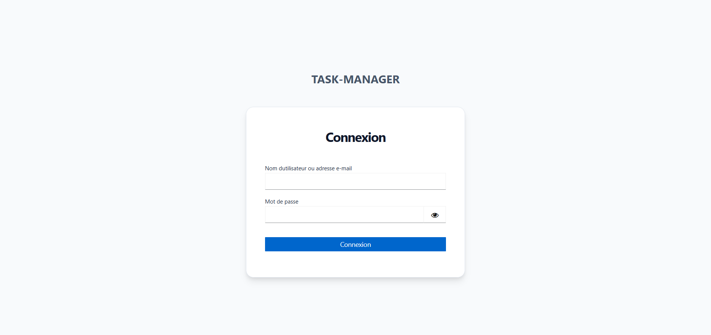
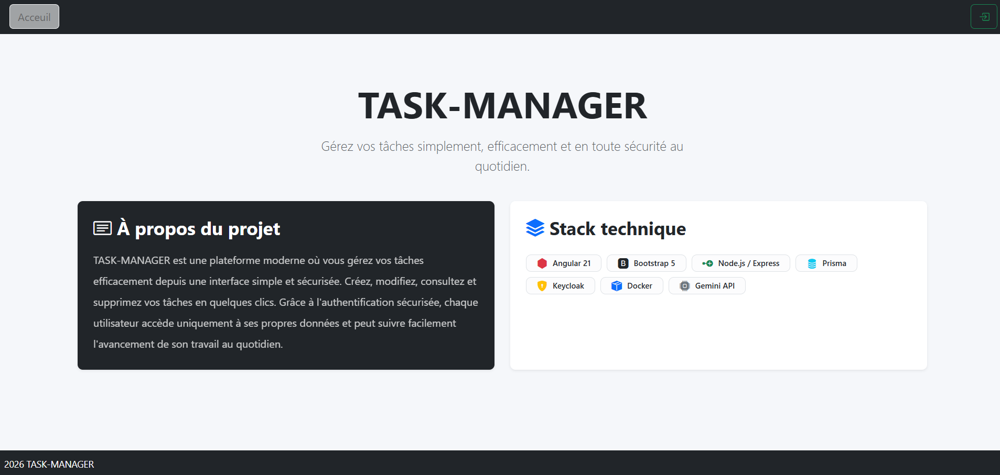
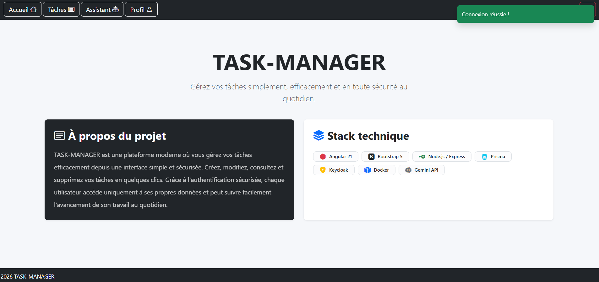
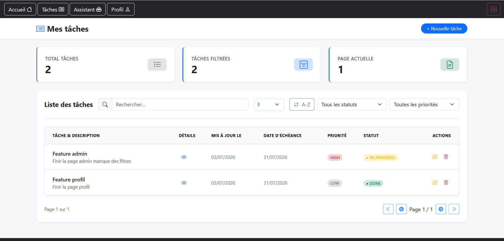
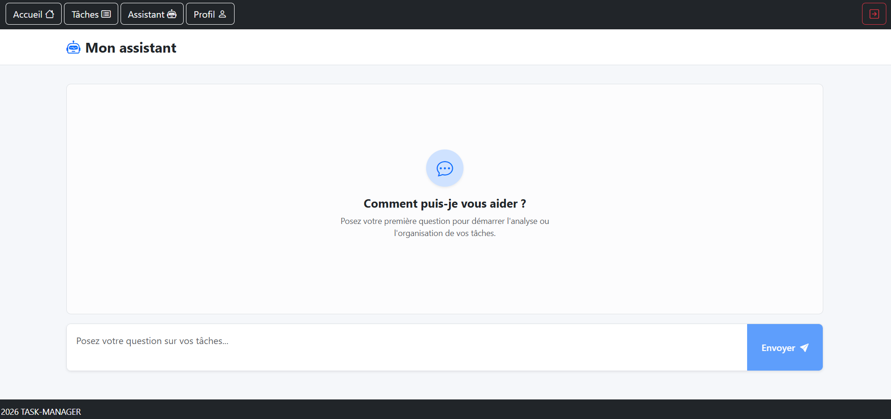
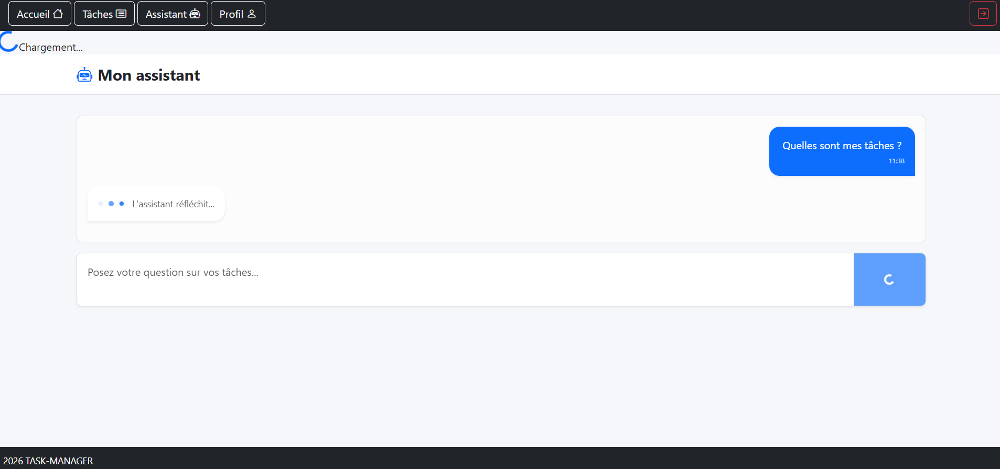
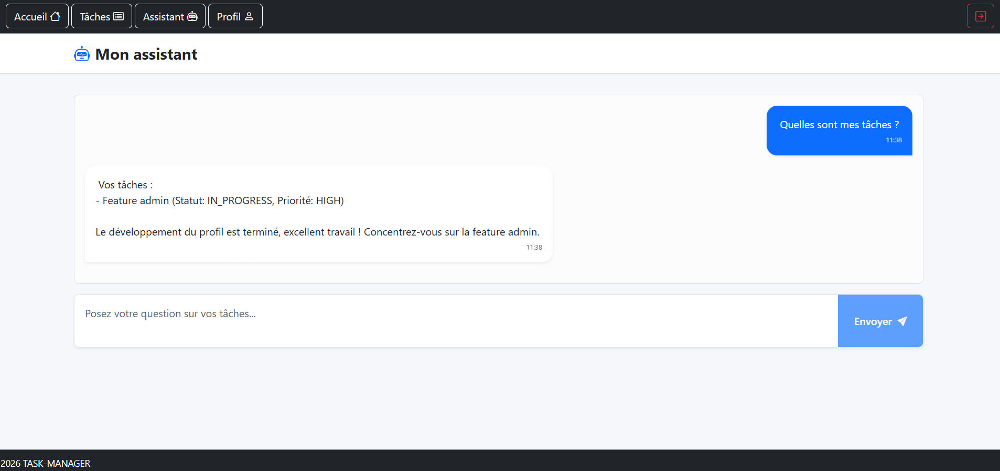

# Task-Manager-MVP 

A full-stack task management application built with Angular, Node.js, PostgreSQL and Keycloak, featuring role-based access control and an AI assistant powered by Google Gemini.

---

# Overview

Task-Manager-MVP is a modern task management application designed with a clean architecture and secure authentication.

The project includes:

* User task management
* Admin dashboard
* Role-based access control (RBAC)
* Keycloak authentication
* Dockerized infrastructure
* AI assistant powered by Google Gemini
* PostgreSQL database with Prisma ORM

---

# Features

# Application Preview

Here are some screenshots of the Task-Manager-MVP in action:

### Login with Keycloak


### Home (Logged out)


### Home (Logged in)


### User Tasks


### AI page


### Gemini AI Chat


### Gemini AI Chat Results


---

### Task Management

* Create tasks
* Edit tasks
* Delete tasks
* Task priorities
* Task statuses
* Due dates

### Authentication

* Keycloak integration
* JWT authentication
* Automatic token refresh
* Route protection
* Role-based access control

### Admin Dashboard

* Global statistics
* Task monitoring
* Search tasks
* Sort tasks
* Delete tasks
* View task owners

### AI Assistant

* Personalized recommendations
* Task analysis
* Priority detection
* Productivity advice
* Context-aware answers based on user tasks

### Infrastructure

* Dockerized environment
* PostgreSQL database
* Keycloak server
* API server

---

# Authentication

The application uses Keycloak for authentication and authorization.

Features:

* JWT-based authentication
* Automatic token refresh
* Protected routes
* Admin role support

---

# AI Assistant

Google Gemini is used to provide contextual answers based on the authenticated user's tasks.

Examples:

* "Do I have any priority tasks?"
* "How should I organize my day?"
* "What should I focus on today?"

---

# Dockerized Environment

Services are managed through Docker Compose:

* Angular frontend
* Express API
* PostgreSQL
* Keycloak

---

# Tech Stack

## Frontend

* Angular 21
* TypeScript
* Signals
* RxResource
* Bootstrap 5

## Backend

* Node.js
* Express.js
* Prisma ORM
* Zod

## Database

* PostgreSQL

## Authentication

* Keycloak
* JWT

## AI

* Google Gemini

## Infrastructure

* Docker
* Docker Compose

---

# Architecture Overview

```txt
Task-Manager-MVP/
├── infra/
├── docs/
└── apps/
     ├── api/
     │    ├── prisma/
     │    └── src/
     │          ├── common/
     │          ├── config/
     │          ├── middlewares/
     │          └── modules/
     └── web/
          └── src/
                └── app/
                     ├── core/
                     ├── feature/
                     └── shared/

```

Backend follows a layered architecture:

Controllers → Services → Repositories → Database

Frontend follows a feature-based architecture:

Core → Shared → Features

---

# Setup Instructions

## Prerequisites

* Node.js >= 18
* npm >= 9
* Docker
* Docker Compose

---

## Clone the repository

```bash
git clone https://github.com/Sandirane/Task-Manager-MVP.git

cd Task-Manager-MVP
```

## Environment Variables
This project requires environment variables to run.

You already have an example file provided (.env.exemple.txt).

Step 1 — Create your .env file

Copy the example file and rename it:

```bash
cp .env.exemple.txt .env
```
Step 2 — Configure your variables

Copy `env.exemple.txt` and rename it to `.env`, then fill in the variables:

```bash
# Database
DATABASE_URL=""
POSTGRES_USER=""
POSTGRES_PASSWORD=""
POSTGRES_DB=""

# API Server
PORT=""
SERVER_URL=""

# API IA
GEMINI_API_KEY=""
GEMINI_MODEL=""

# Keycloak Configuration 
KEYCLOAK_ADMIN=""
KEYCLOAK_ADMIN_PASSWORD=""
KEYCLOAK_URL=""
KEYCLOAK_REALM=""
KEYCLOAK_CLIENT_ID=""
KEYCLOAK_CLIENT_SECRET=""

# Express Session Secret
SESSION_SECRET=""
```

---

## Start services

```bash
docker compose up --build
```

---

# Access URLs

| Service  | URL                                            |
| -------- | ---------------------------------------------- |
| Frontend | [http://localhost:4200](http://localhost:4200) |
| API      | [http://localhost:3000](http://localhost:3000) |
| Keycloak | [http://localhost:8080](http://localhost:8080) |
 
---

# Author

Created by **Sandirane**  
[GitHub Profile](https://github.com/Sandirane)
